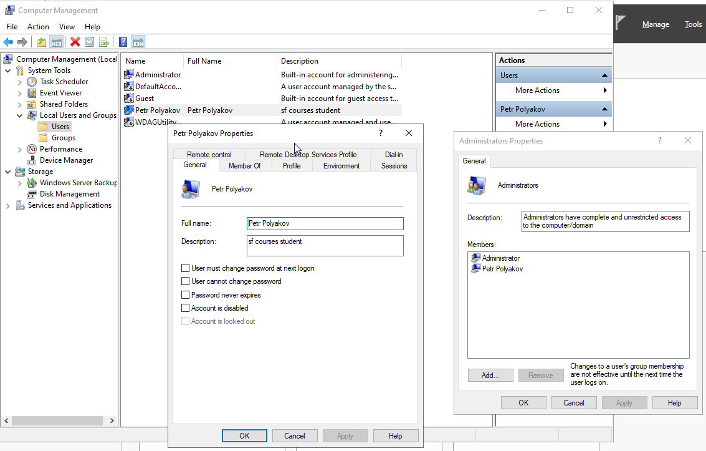
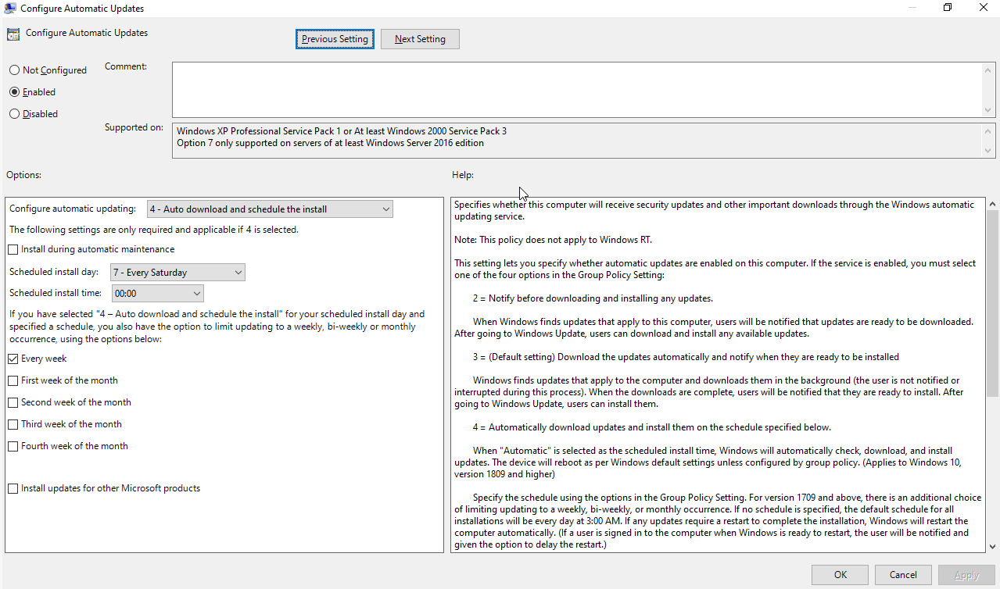
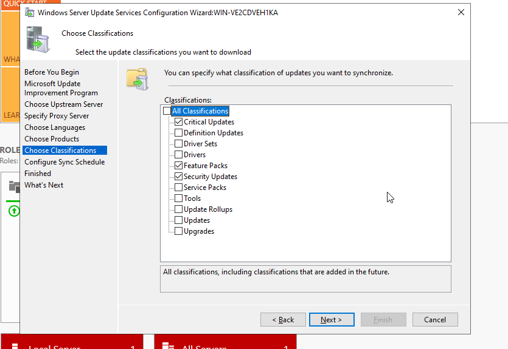
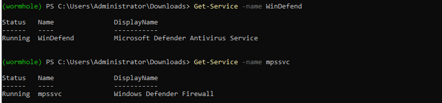
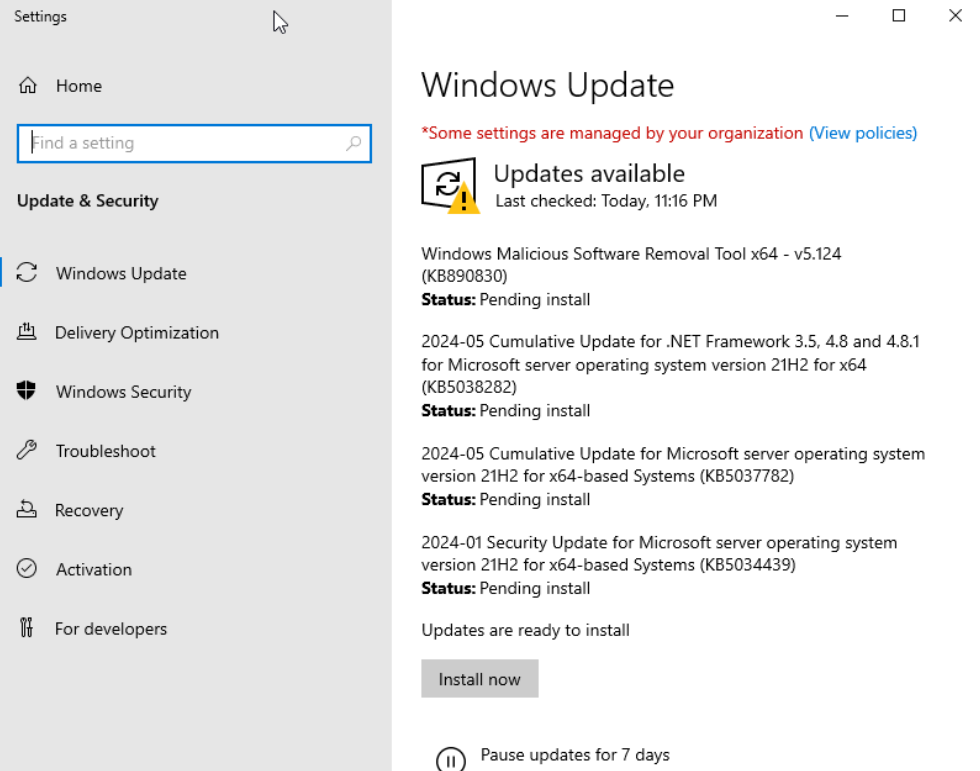
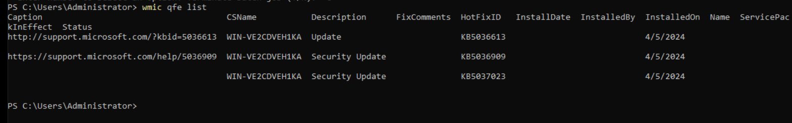
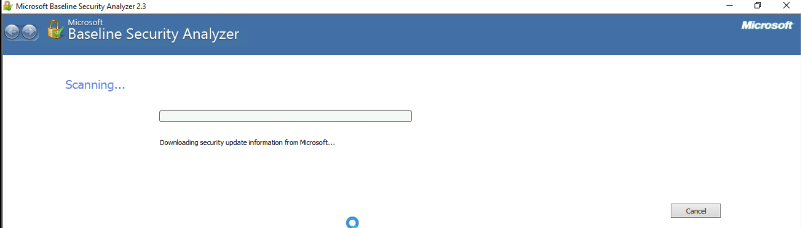
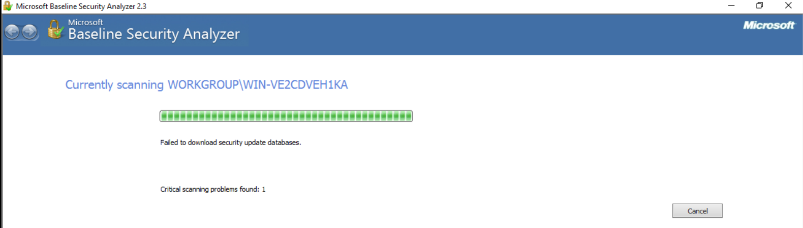
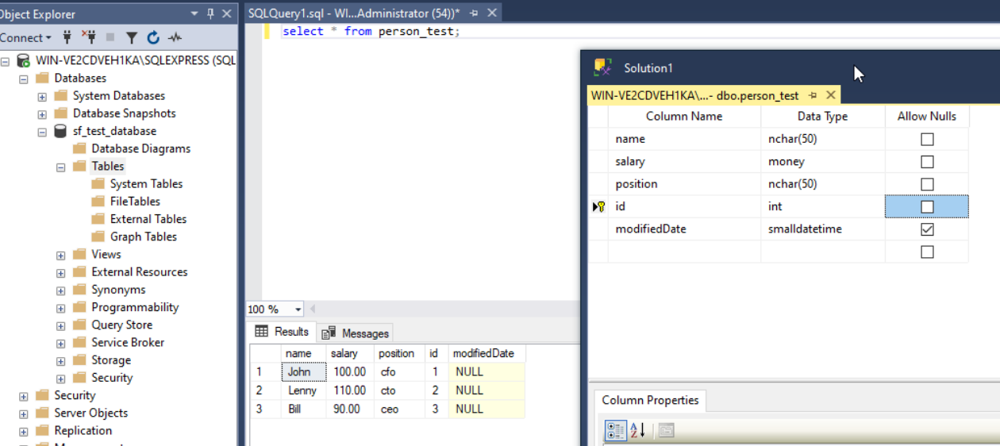

# Windows Server Configuration

## Task & Report

Imagine you are an information security engineer at the Moscow Traffic Control Center. Let's configure your server (Windows Server 2019) according to the checklist:

1. Install Windows Server 2019. You can download the ISO image from [this link](https://www.microsoft.com/ru-ru/evalcenter/evaluate-windows-server-2019).

- [x] done

2. After installation, create an administrator account. Use your first and last name together in Latin letters. Take a screenshot.

❗️ Attention! Attach a screenshot showing the username in the "Computer Management → Users → Local Users" window.

- [x] account created
- [x] added to admin group

3. Configure automatic updates for server versions and patches. Take a screenshot of the updates window.

- [x] automatic updates schedulled
- [x] (alternative solution) WSUS enabled and configured

4. Check if the built-in antivirus is active and all current updates are installed (by any means). Take a screenshot.

- [x] antivirus service checked
- [x] firewall service checked
- [x] installed updates checked
- [x] available updates checked

5. Install [MBSA](https://lms-cdn.skillfactory.ru/assets/courseware/v1/4d1ca365cfa721dec991a79f6bb8f308/asset-v1:SkillFactory+MIFIIB+2022_DEC+type@asset+block/MBSASetup-x64-EN.msi) and scan the operating system for vulnerabilities. Save the MBSA report file. You will need to attach this file to the homework report.

- [MBSA scan xml](./assets/WORKGROUP%20-%20WIN-VE2CDVEH1KA%20(5-30-2024%2012-15%20AM).mbsa)
- [MBSA scan pdf (ready for printing)](./assets/mbsa-scan.pdf)

- [x] MBSA downloaded, moved to VM and installed
- [x] scan sompleted
- [x] report retrieved

> updates db refresh failed by some reason, it is reflected in the report

6. Install SQL Server 2019. Run the program to create records in the database and confirm that everything is ready. Take a screenshot.

- [x] SQL server installed
- [x] SSMS installed
- [x] role assigned for created use
- [x] connected to server via SSMS
- [x] database created
- [x] table created
- [x] rows added and queried for screenshot

7. Describe all your actions in a single report on the work done. Attach a screenshot and a brief description for each step.

- [x] done inline

## REPORT TEMPLATE

- Create a document on Google Drive. Use your full name and group number as the title.
- You can prepare the report in a free form. For example, as a table with three columns: serial number, text description of the action, and screenshot/link to the file.
- Don't forget to attach screenshots where required. In step 5, provide a link to the file with the MBSA scan report (upload it to Drive first).

In the answer submission form, attach a link to the text report on the configured system.

## EVALUATION CRITERIA

- [x] All actions are completed, and the sequence of steps is not violated: 0–1 point.
- [x] Screenshots are attached where needed: 0–3 points.
- [x] Everything is configured correctly: 0–3 points.
- [x] The MBSA report is attached: 0–1 point.
